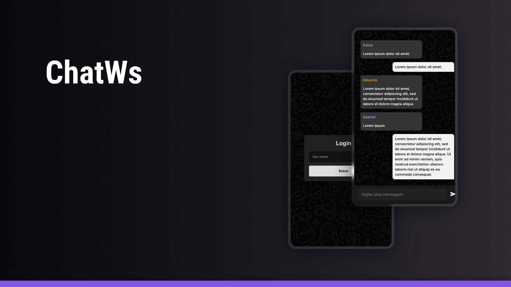

<h1 align="center"> ChatWS </h1>

  <a href="#-tecnologias">Tecnologias</a>&nbsp;&nbsp;&nbsp;|&nbsp;&nbsp;&nbsp;
  <a href="#-projeto">Projeto</a>&nbsp;&nbsp;&nbsp;|&nbsp;&nbsp;&nbsp;
  <a href="#memo-licença">Licença</a>

  

 

  

## 🚀 Tecnologias

Esse projeto foi desenvolvido com as seguintes tecnologias:

- HTML
- CSS
- JavaScript
- WebSockets

## 💻 Projeto

ChatWs é uma ferramenta de chat em tempo real que usa WebSockets. Crie uma sala, compartilhe o link e comece a conversar instantaneamente.

- [Acesse o projeto finalizado, online](https://chatws.onrender.com/)

## :memo: Licença

Esse projeto está sob a licença MIT.

---

By Kaick Oliveira :wave:
